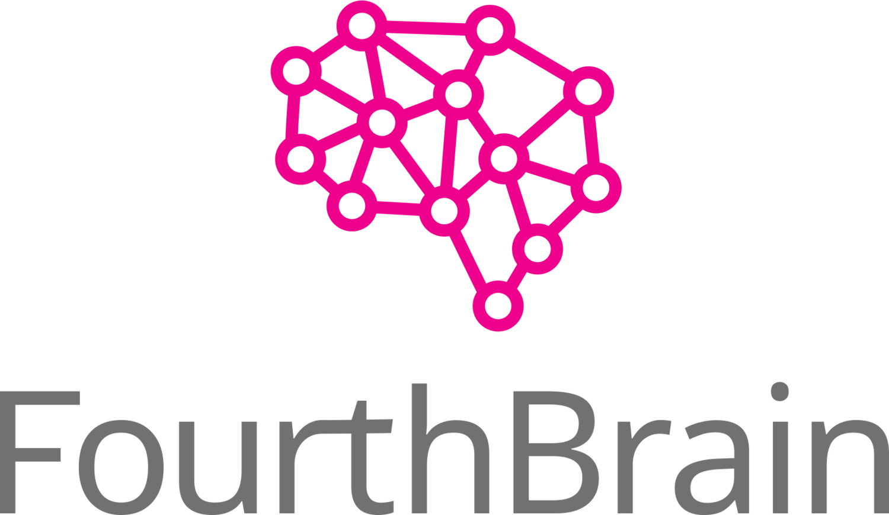
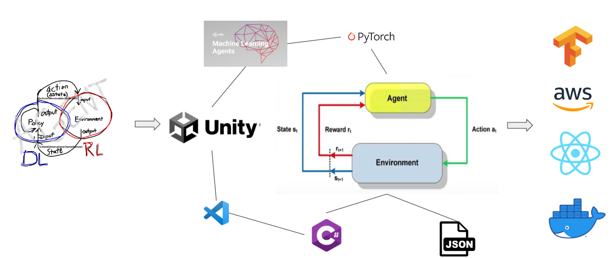
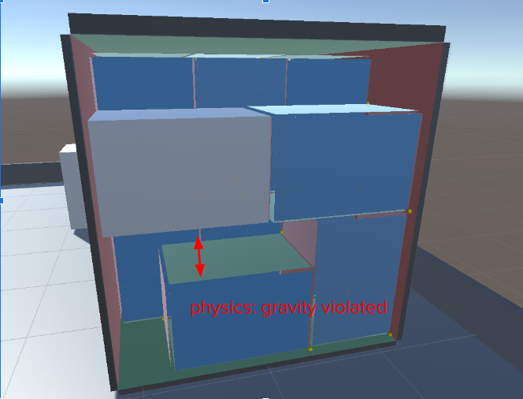
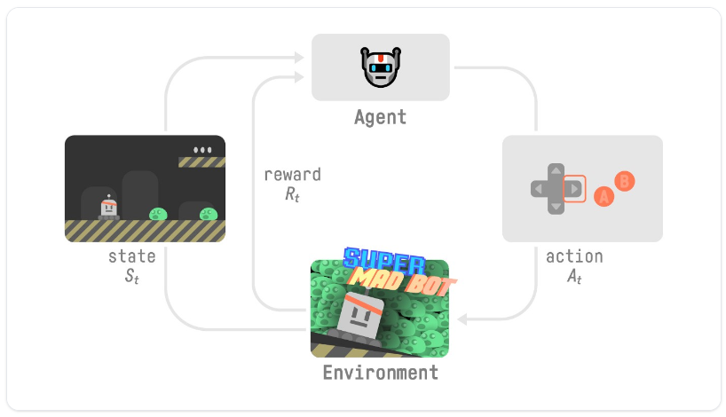
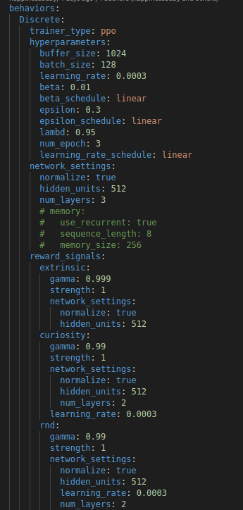
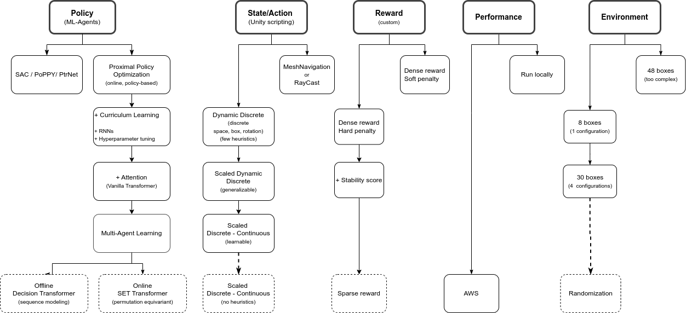

&nbsp;
&nbsp;
&nbsp;
&nbsp;
&nbsp;
&nbsp;
&nbsp;
&nbsp;
&nbsp;
&nbsp;
&nbsp;
&nbsp;
&nbsp;
&nbsp;
&nbsp;
&nbsp;

# PackerHand
The scope of this algorithm is to tackle the problem of insufficient bin packing in the currently overwhelmed supply chains. The bin packing industry  faces itself a number of  challenges and costs related to finding more efficient packing solutions.

The app built can be used to optimally pack boxes into shipping containers, reducing the wasted empty space. This project is issued by [InstaDeep](https://www.instadeep.com/) and carried out as the capstone project of the [Machine Learning Engineer](https://fourthbrain.ai/courses/machine-learning-engineer/) program by [FourthBrain](https://fourthbrain.ai/).

## Motivation
The bin packing industry  faces a number of  challenges and costs related to not efficient packing solutions. In fact, more than 25% of what companies ship in non-optimized packaging is air. Considering the million of containers and packages shipped every day, this amounts to significant financial, transportation and storage costs; especially for large logistic companies like Amazon. Let alone the excess waste and emissions impacting the environment. Additionally, even with companies investing on experienced employees and heuristic methods, bin-packing remains complex and time-consuming. InstaDeep’s research indicates that a 6% volume savings for 15 containers (~3,000 packages) can reduce costs by at least $7,000.  For a company like Amazon that ships 1.6M packages a day, a cost reduction of $3.7M ($7,000*1.6M/3,000) per day is theoretically possible. 

Thereby, there is a large opportunity to decrease shipping & enviromental costs by increasing packing effectiveness. The main goal is the minimization of the wasted bin space.  

Scientifically, this is an NP-hard combinatorial optimization problem which heuristiscs methods yet have to effectively solve.

## Objective

The PackerHand app is an AI-driven solution that delivers exact box placement instructions which the packing expert or robotic arm can use to pack the available boxes with specific order into designated positions of the container. In specific, the AI agent is trained using Deep Reinforcement Learning techniques in a customizable physics-simulating environment. The frontend provides a user-friendly web interface where the user may seemlessly add the number and sizes of boxes to be packed and in a matter of seconds acquire the output with the placement of these boxes inside an industrial container.

# Getting started

## How to use
Step-by-step guide on using the app. 
- Go to web UI
- Fill up with box sizes
- Press submit
- Retrieve output
## Installing 

See here for [Unity installation](https://learn.unity.com/tutorial/install-the-unity-hub-and-editor) and [ML-agents installation](https://unity-technologies.github.io/ml-agents/Installation/).

## Deployment
See Dockerfile

# UI Demo
[demo](/docs/images/packingdemo.gif)

# Tech stack
- Data input: JSON
- Output visualization: Unity graphics
- Monitoring: Tensorboard
- Simulation environment: Unity & C#
- DRL model: ML-Agents & PyTorch
- Deployment: Docker, AWS
- Fronted: Web app with React

# Features
We train a Deep Reinforcement Learning (DRL) agent using a policy with specified reward and observation states. The goal is to teach the agent to pack as many boxes into the bin as possible.

## Unity environment

### Unity scene
##### [scene](https://github.com/bryanat/Reinforcement-Learning-Unity-3D-Packing/tree/master/Assets/ML-Agents/packerhand/Scenes)

A Unity scene is created, namely "BinPacking001". The scene is populated with:
- A platform acting as the ground.
- Walls surrounding the platform and effectively preventing the agent to "escape".
- The industrial container bin with real-life dimensions.
- An area that boxes are initially spawned, outside the bin.
- The trainable PackerHand agent as a cylinder object.

Collider objects are assigned to the boxes and the bin in order to simulate collision and contact.

 

&nbsp;
&nbsp;

 

### Customized environment in C#
##### [scripts](https://github.com/bryanat/Reinforcement-Learning-Unity-3D-Packing/tree/master/Assets/ML-Agents/packerhand/Scripts)

 The process of spawning boxes, agent training and physics simulation is customized with ~2000 lines of written code divided in 7 new classes:

- PackerHand.cs

  The trainable agent that acts in the environemnt and controls the learning process ([PackerHand agent](#agent)).

- Binspawner.cs

  Used for multi-platform learning. Spawns new container bins at proper distance, assigns the PackerHand.cs agent and spawns new boxes at the proper location using the Boxspawner.cs 

- BoxSpawner.cs

  Spawns boxes on the designated spawning area (outside the bin) with dimensions specified by the user.

- CombineMesh.cs

  Once a box is placed inside the bin it becomes its child object. This class combines the mesh of the box children to the mesh of the bin parent object.

- SensorCollision.cs

  Detects collision/contant between the box that is currently being packed and the current topology of the bin (the bin walls and the boxes already placed inside the bin). Additionally, it checks for violation of gravity; for example, when the bottom of the currently packed box is not properly supported (see [Physics Checks](#physics-checks)). The results regarding contact are also used for the [stability reward](#reward).  

- SensorOuterCollision.cs

  Detects collision/protrusion between the box currently being packed and the walls of the bin (see [Physics Checks](#physics-checks)).

- SensorOverlapCollision.cs

  Detects overlapping between the box currently being packed and the boxes already packed and already combined with the bin mesh/topology (see [Physics Checks](#physics-checks)).

### Physics checks
Rigidbody properties are assigned to all included bodies simulating the laws of physics.

&nbsp;

There are 3 scenarios of physics violation:
- The packed box is protruding outside the walls of the bin
- The packed box is ovellapping with other already packed boxes
- The packed box is not properly supported (vioalting gravity)

To teach the agent to obey the above physics laws and to avoid applying heuristics - avoid constraining the freedom of the agent to learn its own way - we used reward shaping. Specifically, a penalty (negative) reward is applied every time the agent violates physics. Additionally, the learning episode is terminated. The bin is emptied, the boxes reset and packing begins again. (see [Rewards](#rewards))

## Reinforcement Learning with ML-Agents
##### [ML-Agents Toolkit](https://github.com/gzrjzcx/ML-agents/blob/master/docs/ML-Agents-Overview.md)

Summary of Reinforcement Learning:
- Our Agent receives state S0 from the Environment — we receive the first frame of our game (Environment).
- Based on that state S0, the Agent takes action A0​ — our Agent will move to the right.
- Environment goes to a new state S1​ — new frame.
- The environment gives some reward R1​ to the Agent (positive/negative)

 

 
<!--  -->

Unity ML-Agents (Machine Learning Agents) is an open-source Unity plugin that allows developers to integrate artificial intelligence (AI) agents into their Unity games or simulations. It provides a platform for training and testing AI agents using reinforcement learning, imitation learning, and other machine learning algorithms. The toolkit includes various pre-built environments and examples to help developers get started, as well as support for custom environments and agents. Unity ML-Agents is designed to be accessible to both beginners and experienced AI developers, and can be used for a wide range of applications, from game development to robotics research.

 

Trainng with ML-Agents is described [here](https://github.com/gzrjzcx/ML-agents/blob/master/docs/Training-ML-Agents.md#training-with-mlagents-learn)

### PackerHand Agent
Each time a box needs to be packed from the spawning area into the bin, the agent:
  1. observes the current state/enviroment of the bin
  2. decides which action to take next: 
     - wchich box to place next 
     - at which position 
     - with which specific rotation
  3. picks up the box and carries it to the proper location
  4. checks against physics: gravity, overlapping with other boxes, protrusion beyond the extents of the bin (see [Physics Checks](#physics-checks))
  5. if the physics checks are passed, the agent repeats by taking a new decision

### Configuration / Hyperparameters
##### [YAML](https://github.com/bryanat/Reinforcement-Learning-Unity-3D-Packing/tree/master/config)

Our policy is online and thus we want our agent to backpropagate and update its PPO policy rathen often. Therefore, we define:
- "batch size"

  the number of experiences to collect before updating the policy model. Our agent uses an online policy which means that it interacts with environment, collects runtime experience and updates regularly. Thus, small value needs to be set for the batch size.

- "buffer size"

  similar to the batch size and the online training principles, a small value is set here as well.

- "gamma" 
  
   orresponds to the discount factor for future rewards. This can be thought of as how far into the future the agent should care about possible rewards. Our agentshould be acting in the present with the incentive of rewards in the distant future; that is the large reward when the bin is fully packed. Thus, a relatively large gamma value is used.

 

For more exaplanation of the various parameters in the .yaml file see also 
the [training config file](https://github.com/gzrjzcx/ML-agents/blob/master/docs/Training-ML-Agents.md#training-ml-agents) section.

#### Policy 
We use PPO as our baseline model with an addition of 'curiosity' to promote better exploration.
PPO, being an on-policy network with safe gradient updates, helps to ensure that eventual convergence happens relatively quickly. One of its shortcoming is that it is not permutation invariant, which makes solving combinatorial problems such as 3D bin packing very difficult. We found ways to combat this to a certain degree through feature engineering. We added both Curiosity Module ([Curiosity-driven Exploration by Self-supervised Prediction](https://arxiv.org/pdf/1705.05363.pdf)) and Random Walk Distillation ([RND](https://arxiv.org/pdf/1810.12894.pdf)) onto PPO. We found curiosity an intrinsic driving force in our environment where exploration is much needed before exploitation and rewards are both sparse and dense. (see section on hyperparameters and reward shaping )
#### Observations
Observations are the information our agent gets from the environment.
We implemented regular sensors composed of vertices information alongside attention-imbued buffer sensors as explained in the "attention mechanims" section. For ease of training, we provided our agent with a vertices array from which to select box positions. The vertices array is constructed using “tripoints”, which are the 3 concave vertices from a previously placed box. This leaves the agent with a limited number of choices to base its selection from. We padded both regular sensors and sensor buffers with a maximum box quantity so that the sizes of action and state spaces can stay constant. In turn, we were able to automate the process of training without having to manually adjust the sizes of brain parameters for each different box set.
#### Actions
The Action space is the set of all possible actions in an environment. The action of our agent come from a discrete environment. Every time the agent is called to make a decision, simulteously the 3 following actions are decided:

1. The available positions vector:

   This is a variable size vector that contains the vertices of the topology inside the bin. The topology changes after placing each  box inside the bin. Thus, the vector size changes as well. 
   
2. The spawned boxes vector

   This vector contains all the boxes to be fitted to the bin. Its size is also reduced after is box is placed inside the bin. 

3. The rotations vector

   Always 6 available rotations since we are only fitting cubic boxes for our baseline model

Masking of actions is aso implemented preventing boxes that are already packed to be available in the action selection.

#### Reward shaping
We found a combination of dense (extrinsic) and sparse (intrinsic) rewards work best at maximizing percent volume packed without compromising good box placements. For improved box placements, we gave a stability score, which helps set some basic rules to packing, such as packing boxes close together in a back to front, bottom to top manner. We gave hard penalty for failing physics check and a substantial larger reward when the percent volume filled is above a certain threshold

#### Attention mechanism
We used “observation buffers” provided in MlAgents toolkit to tackle the problem of having a varying number of observation due to the need to pack different sets of boxes. The build-in Attention Module for observation buffers allows our agent to pay more attention to changes in the environment and less to the constants. In practice, using one-hot-encoding, each box has its own package of information saved inside the buffer that is updated every frame. 
#### Memory-enhancement using RNN
##### 
Deciding what the agents should remember in order to solve a task is not easy to do by hand, but our training algorithm can learn to keep track of what is important to remember with LSTM. To use the LSTM, training "remembers" a sequence of experiences instead of single experiences. The downside is that the training of the agents slows down.

#### Curriculum learning
Curriculum learning is a way of training a machine learning model where more difficult aspects of a problem are gradually introduced in such a way that the model is always optimally challenged. This idea has been around for a long time, and it is how we humans typically learn. If you imagine any childhood primary school education, there is an ordering of classes and topics. Arithmetic is taught before algebra, for example. Likewise, algebra is taught before calculus. The skills and knowledge learned in the earlier subjects provide a scaffolding for later lessons. The same principle can be applied to machine learning, where training on easier tasks can provide a scaffolding for harder tasks in the future.

The [Wall Jump](https://github.com/Unity-Technologies/ml-agents/blob/develop/docs/Learning-Environment-Examples.md#wall-jump) example shows a simple implementation of Curriculum Learning with Unity ML-Agents.

For PackerHand we tested our agent with curriculum learning. For curriculum to be most effective, we created a random box and a random bin generator. Thus, we could train our agent on a random set of boxes that potentially would fill up the entire bin. The first lessons of curriculum learning were simple enough that the agent could be taught on how to observe the space, learn not to violate physics, learn about the total reward that can be collected. If, instead, the first lesson was complex, then the agent might never reach the total reward and might also never learn compying to physics laws. Combined with multiplatform, curriculum learning has the potential of allowing a model to reach greater degree of generalization.

The Curriculum Learning lessons are configured in the [YAML file](https://github.com/bryanat/Reinforcement-Learning-Unity-3D-Packing/tree/master/config).

#### Multi-platform training

Multi-platform - With multi-platform,  we found PPO performs better overall with more consistency, better convergence, and improved stability and speed using 1-2 platforms per CPU core with added GPU power. Having parallel environments also gives us the capability to set up different box sets on different platforms for greater data variability

<!--  

  -->

<!--  -->

## Tensorboard

## Training workflow

The workflow is the following:
1. State S0
    - Boxes are spawned in the spawning area outside the bin
    - The initial Observations Vector is formed. It contains the possible positions to place the next box, the boxes to be placed and their rotations.
2. Agent
    - Collects the Observations Vector from the state S0.
    - The PPO initializes the weights of the DNN brain.
3. Action
    - The agent selects a box from the Observations Vector
    - The agent selects a rotation from the Observations Vector
    - The agent selects a position from the Observations Vector
    - The selected box is placed at the selected position inside the bin, with the selected rotation.
4. State S1 
    - The placed box is merged with the bin mesh
    - The topology inside the bin is updated. The box is now placed. The Observations Vector is modified accordingly (new available positions, one less box, 6 rotations)
    - A reward is given based on the new state in the environment.
5. Agent 
    - Based on the reward, the agent updates the weights of the Brain.
    - The agent collects the new Observations Vector
6. Repeat steps (3) - (6) until episode ends.
7. Episode ends when:
    - All boxes are packed (positive reward)
    - Physics are violated (negative reward)
    - More than 15000 steps have been utilized per episode (negative reward)

 

 

# Limitations & Remedies

## Limitations
- Limited generalization: Our agent can accurately fit around 30 boxes with 4 cubic shapes at ~90% volume. Increasing the quantity and sizes of boxes will require additional training. 
- Performance: Training the agent is moderately computationally expensive due to an environment that simulates physics, movement, collision, mesh combining, gravity and box overlapping. Training can be done on cloud engines, such as AWS, while still maintaining a manageable training speed, despite the extended physics processes.

## Remedies
- Expand the training of the agent to higher quantity and various sizes of boxes; effectively build a "box dictionary". Each item in the "box dictionary" would have characteristic size (raning in the order of 10 cm) and and shape (x,y,z acis). Shape should remain cubic. The PPO will recognize each box using one-hot encodings in the observation vector. 
- Treat the box "dictionary" as a language model and the reinforcement learning as a sequence model. To achievet this, train a permutation equivariant transformer ([SET transformer](https://github.com/juho-lee/set_transformer)) on the tokenized vocabulary.
- Increase computational performance by switching to Offline Reinforcement Learning using a [Decision Transformer](https://github.com/kzl/decision-transformer). 
- Implement cooperative multi agent training. Thereby, multiple agents will cooperate in the decision making process. Each agent will become expert to a specific decision, thus effectively decomposing the 3-fold action space. Cooperation between the agents, using each for the corresponding decision in each environment step, will lead to improved performance and generalization. 

# DRL stack evolution
The system consists of five components, each undergoing its own process of evolution through performance and problem-solving decisions. Our implementation diagram (blue frame) shows the stages and future improvements. 

The Policy component is the "brain" that seeks to maximize rewards by packing boxes into a bin. We established a baseline model using Proximal Policy Optimization for better performance than other DRL algorithms. To address the problem's combinatorial complexity, we applied Curriculum Learning with lessons of increasing difficulty. We introduced the multi-headed attention mechanism to handle dynamic action/state space. The computational performance runs on multiple platforms in parallel on AWS, training one agent. Initially, reward shaping had dense rewards. We later implemented the stability reward, rewarding agent stacking boxes with adjacent boxes, and introducing penalties to prevent environment manipulation. The goal is to sparse out the reward component. We use a hybrid of discrete and continuous state/action space to generalize modeling compared to the initial options and heuristics. Feature engineering is a major part of our efforts. We are generalizing the agent by sparsing out our reward policy and reducing heuristics used for modeling state/action space while attempting to implement Transformers.

# Responsible AI
We take care that our AI system is built upon ethical and responsible development, deployment, and use of artificial intelligence technologies. This is why we make sure that:
- Our AI system is fair, transparent, and accountable; ensuring no harm to individuals or society. 
- We consider data privacy, bias mitigation, human oversight, and ethical decision-making.
- We practise ongoing monitoring and evaluation of the system to ensure that it continues to operate in a responsible and ethical manner. 

Some specific considerations for responsibilities of our AI system:
- Human oversight: If companies rely too heavily on AI for container packing without adequate human oversight and intervention, it could result in errors or unexpected outcomes. For example, the AI algorithm may prioritize efficiency over safety and pack boxes in a way that compromises the integrity of the shipment.

- Fairness: If the AI algorithm is trained on biased or incomplete data, it could result in discriminatory outcomes. For example, if the algorithm is only trained on data from a particular region or demographic group, it may not be effective at packing boxes for a more diverse set of customers.

- Transparency: If the AI algorithm is not transparent and does not provide explanations for its decisions, it could be difficult to detect and correct errors or biases. This could also lead to mistrust from customers and other stakeholders.

- Security and Privacy: If the AI algorithm is not properly secured, it could be vulnerable to cyber attacks or unauthorized access. This could result in the theft or misuse of sensitive customer data.

- Environmental Impact: If the AI algorithm is only focused on optimizing container packing for efficiency and cost savings, it may not take into account the environmental impact of transportation. This could result in increased carbon emissions and contribute to climate change.

- Support Labor Displacement: If the AI algorithm is too effective at container packing, it could potentially displace human workers in the industry. This could have negative social and economic impacts if there are not adequate measures in place to support displaced workers.

Overall, it is important to approach AI in the container packing industry with caution and to ensure that responsible AI practices are being followed to mitigate these risks.

# Team members
This product was developed by [Bryan Boyett](https://github.com/bryanat) & [Yueqi Peng](https://github.com/happinessbaby) & [Pano Evangeliou](https://github.com/PanoEvJ).

# Acknowledgements
Hat tip to our FourthBrain-MLE11 instructors [Anna Marek](linkedin.com/in/anna-marek), [Milica Cvetkovic](linkedin.com/in/iammilica) and [Chris Alexiuk](linkedin.com/in/csalexiuk) for contributing to this project with their contructive feedback and inspiration. 

 
