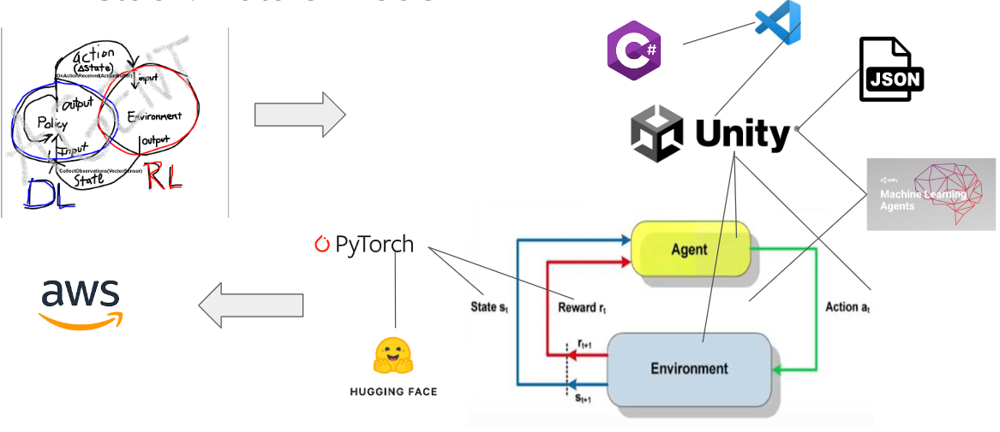

<!--  # DRL-RNN-LSTM-BOX-SIM -->
<!-- - ## DRL - Deep Reinforcement Learning -->
<!-- - ## RNN - Recurrent Neural Network -->
<!-- - ## LSTM - Long Short Term Memory (RNN derivative) -->
<!-- - ## BOX - Box. Box. Box. (RL Agent's existence) -->
<!-- - ## SIM - Simulation in Unity/Gym (RL Environment) -->

# PackerHand
The scope of this algorithm is to tackle the problem of insufficient bin packing in the currently overwhelmed supply chains. The bin packing industry  faces itself a number of  challenges and costs related to finding more efficient packing solutions.

The app built can be used to optimally pack boxes into shipping containers, reducing the wasted empty space. This project is issued by [InstaDeep](https://www.instadeep.com/) and carried out as the capstone project of the [Machine Learning Engineer](https://fourthbrain.ai/courses/machine-learning-engineer/) program by [FourthBrain](https://fourthbrain.ai/).

***include Fourthbrain and instadeep logo
## Motivation
The bin packing industry  faces a number of  challenges and costs related to not efficient packing solutions. In fact, more than 25% of what companies ship in non-optimized packaging is air. Considering the million of containers and packages shipped every day, this amounts to significant financial, transportation and storage costs; especially for large logistic companies like Amazon. Let alone the excess waste and emissions impacting the environment. Additionally, even with companies investing on experienced employees and heuristic methods, bin-packing remains complex and time-consuming. InstaDeep’s research indicates that a 6% volume savings for 15 containers (~3,000 packages) can reduce costs by at least $7,000.  For a company like Amazon that ships 1.6M packages a day, a cost reduction of $3.7M ($7,000*1.6M/3,000) per day is theoretically possible. 

Thereby, there is a large opportunity to decrease shipping & enviromental costs by increasing packing effectiveness. The main goal is the minimization of the wasted bin space.  

Scientifically, this is an NP-hard combinatorial optimization problem which heuristiscs methods yet have to effectively solve.

## Logic
***lock example

## Objective

The PackerHand app is an AI-driven solution that delivers exact box placement instructions which the packing expert or robotic arm can use to pack the available boxes with specific order into designated positions of the container. In specific, the AI agent is trained using Deep Reinforcement Learning techniques in a customizable physics-simulating environment. The frontend provides a user-friendly web interface where the user may seemlessly add the number and sizes of boxes to be packed and in a matter of seconds acquire the output with the placement of these boxes inside an industrial container.

# Getting started

## Prerequisites

## How to use
Step-by-step guide on using the app. 
- Website screenshot
- Fill up with box sizes
- Press submit
- Retrieve output
## Installing 

## Deployment

# UI Demo

# Tech stack
- Conceptual: scribbles & drawings
- Simulation environment: Unity & C#
- Box input: JSON
- DRL model: ML-Agents & PyTorch
- Visualization: Unity graphics & Tensorboard performance
- Deployment
- Fronted: Web app with React

## Tensorboard

# Backend features
We train a Deep Reinforcement Learning (DRL) agent using a policy with specified reward and observation states. The goal is to teach the agent to pack as many boxes into the bin as possible.

## Reinforcement Learning
Summary of Reinforcement Learning:
- Our Agent receives state S0 from the Environment — we receive the first frame of our game (Environment).
- Based on that state S0, the Agent takes action A0​ — our Agent will move to the right.
- Environment goes to a new state S1​ — new frame.
- The environment gives some reward R1​ to the Agent (positive/negative)

### Policy 
Implement transformers (decision transformer / set transformer) in a multi-agent environment
### Observations
Observations are the information our agent gets from the environment.
### Actions
The Action space is the set of all possible actions in an environment. The action of our agent come from a discrete environment. Every time the agent is called to make a decision, simulteously the 3 following actions are decided:

1. The available positions vector:

   This is a variable size vector that contains the vertices of the topology inside the bin. The topology changes after placing each  box inside the bin. Thus, the vector size changes as well. 
   
2. The spawned boxes vector

   This vector contains all the boxes to be fitted to the bin. Its size is also reduced after is box is placed inside the bin. 

3. The rotations vector

   Always 6 available rotations since we are only fitting cubic boxes for our baseline model

#### Masking
### Reward
Shape/Tune reward towards a more sparse behavior

### Curriculum learning

### Multi-platform training
Automate running on the cloud
Randomization of environment to ensure scalability
### Attention mechanism

 

# Training workflow

The workflow is the following:
1. State S0
    - Boxes are spawned in the spawning area outside the bin
    - The initial Observations Vector is formed. It contains the possible positions to place the next box, the boxes to be placed and their rotations.
2. Agent
    - Collects the Observations Vector from the state S0.
    - The PPO initializes the weights of the DNN brain.
3. Action
    - The agent selects a box from the Observations Vector
    - The agent selects a rotation from the Observations Vector
    - The agent selects a position from the Observations Vector
    - The selected box is placed at the selected position inside the bin, with the selected rotation.
4. State S1 
    - The placed box is merged with the bin mesh
    - The topology inside the bin is updated. The box is now placed. The Observations Vector is modified accordingly (new available positions, one less box, 6 rotations)
    - A reward is given based on the new state in the environment.
5. Agent 
    - Based on the reward, the agent updates the weights of the Brain.
    - The agent collects the new Observations Vector
6. Repeat steps (3) - (6) until episode ends.
7. Episode ends when:
    - All boxes are packed (positive reward)
    - Physics are violated (negative reward)
    - More than 15000 steps have been utilized per episode (negative reward)

## DRL

### Bryan: `mlagents_envs` (environment state) RL-side of DRL (RL Simulation/Environment-driven) (red)
### Yueqi: `mlagents` (learning algorithms) DL-side of DRL (DL Model/Policy-driven) (blue)
Unity ML-Agents: "`mlagents` provides a set of reinforcement and imitation learning algorithms designed to be used with Unity environments. The algorithms interface with the Python API provided by `mlagents_envs`."

# Limitations & Remedies

## Limitations
- Limited generalization: Our agent can accurately fit around 30 boxes with 4 cubic shapes at ~90% volume. Increasing the quantity and sizes of boxes will require additional training. 
- Performance: Training the agent is moderately computationally expensive due to an environment that simulates physics, movement, collision, mesh combining, gravity and box overlapping. Training can be done on cloud engines, such as AWS, while still maintaining a manageable training speed, despite the extended physics processes.

## Remedies
- Expand the training of the agent to higher quantity and various sizes of boxes; effectively build a "box dictionary". Each item in the "box dictionary" would have characteristic size (raning in the order of 10 cm) and and shape (x,y,z acis). Shape should remain cubic. The PPO will recognize each box using one-hot encodings in the observation vector. 
- Treat the box "dictionary" as a language model and the reinforcement learning as a sequence model. To achievet this, train a permutation equivariant transformer ([SET transformer](https://github.com/juho-lee/set_transformer)) on the tokenized vocabulary.
- Increase computational performance by switching to Offline Reinforcement Learning using a [Decision Transformer](https://github.com/kzl/decision-transformer). 

# DRL stack evolution
he system consists of five components, each undergoing its own process of evolution through performance and problem-solving decisions. Our implementation diagram (blue frame) shows the stages and future improvements. 

The Policy component is the "brain" that seeks to maximize rewards by packing boxes into a bin. We established a baseline model using Proximal Policy Optimization for better performance than other DRL algorithms. To address the problem's combinatorial complexity, we applied Curriculum Learning with lessons of increasing difficulty. We introduced the multi-headed attention mechanism to handle dynamic action/state space. The computational performance runs on multiple platforms in parallel on AWS, training one agent. Initially, reward shaping had dense rewards. We later implemented the stability reward, rewarding agent stacking boxes with adjacent boxes, and introducing penalties to prevent environment manipulation. The goal is to sparse out the reward component. We use a hybrid of discrete and continuous state/action space to generalize modeling compared to the initial options and heuristics. Feature engineering is a major part of our efforts. We are generalizing the agent by sparsing out our reward policy and reducing heuristics used for modeling state/action space while attempting to implement Transformers.

# Responsible AI
We take care that our AI system is built upon ethical and responsible development, deployment, and use of artificial intelligence technologies. This is why we make sure that:
- Our AI system is fair, transparent, and accountable; ensuring no harm to individuals or society. 
- We consider data privacy, bias mitigation, human oversight, and ethical decision-making.
- We practise ongoing monitoring and evaluation of the system to ensure that it continues to operate in a responsible and ethical manner. 

Ultimately, the goal of our AI system is to harness the potential of AI technology for the benefit of all, while minimizing its risks and negative impacts.

# Team members
This product was developed by [Bryan Boyett](https://github.com/bryanat) & [Yueqi Peng](https://github.com/happinessbaby) & [Pano Evangeliou](https://github.com/PanoEvJ).

# Acknowledgements
Hat tip to our FourthBrain-MLE11 instructors [Anna Marek](linkedin.com/in/anna-marek), [Milica Cvetkovic](linkedin.com/in/iammilica) and [Chris Alexiuk](linkedin.com/in/csalexiuk) for contributing to this project with their contructive feedback and inspiration. 

<!-- ## Data: State generated through RL environment
### <ins>Constant: Data that’s provided</ins>
- 3d size of the container, 3d size of the boxes, quantity of boxes, id of each box 
- Position of the truck
- Gravity and mass of boxes

### <ins>Dynamic: Data that the RL agent can change</ins>
- State: data observed by the RL agent, input to the agent brain’s policy
  - State tensor: [[[x1, y1, z1], [x2, y2, z2], etc.], [[l1, w1, h1], [l2, w2, h2], etc], [m1, m2, etc]]
    - 1st dimension describes the 3d position of the boxes
    - 2nd dimension describes the size of the boxes
    - 3rd dimension describes the mass of the boxes
- Action: data changed by the RL agent, output from the agent brain’s policy
  - Action-space tensor: [[0, 1], [+1x, -1x, +1y, -1y, +1z, -1z]]
    - This 2d tensor consists of 2 dimensions of action
    - 1st dimension is a discrete action space that describes a boolean whether a box is picked up or dropped
    - 2nd dimension is a discrete action space that describes 6 directions the agent can take

## Model: Policy generated through DL(+RL) patterns
<ins>Deep Learning: Agent brain’s policy</ins>
- Learning options: 
  - Heuristics
  - LSTM
  - Pointer Network
  - Attention-based RNN
  - Transformer

#### Attention mechanisms are probabilistic mechanisms
## Multiple different Agent Models/"Brains": turn our problem of "which model may lead to most optimization?" as apart of the final solution
- ### in the same environment, state space, and action space for agents, have agents with different "brains" (models generating thier policy and thus actions)
  - #### such as lines of trucks with each agent packing the truck, like agent parallelism, but plotting/visualizing the metrics of efficiency and model performance (stretch: if can plot/visualize above each truck or on the ground along with a name on the ground of each agents model type, alternative is a UI that can be expanded or collapsed with an arrow)
- ### stretch goal: multi-agent learning. could an agent with a core lesser model (such as non-transformer) + learning from observing other agents actions sequence learn from an agent who has a core greater model (such as transformer)
#### (decision) transformers: optimal inference, non-optimal training
  - #### transformers are great off the shelf for inference once trained, but they require a lot of data to train (optimal inference, non-optimal training)
  - #### this may be because they are sequence based (and visiting all the possible sequences of state space is effectively combinatorial or !)
  - #### recent 100,000 timesteps will influence network more than previous 100,000 timesteps (sequences with decay create adaptive bias) -->

 
