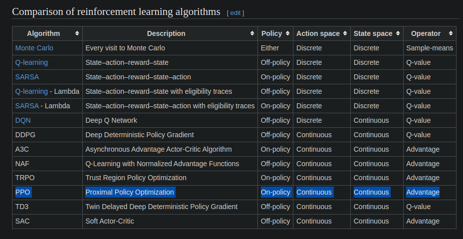
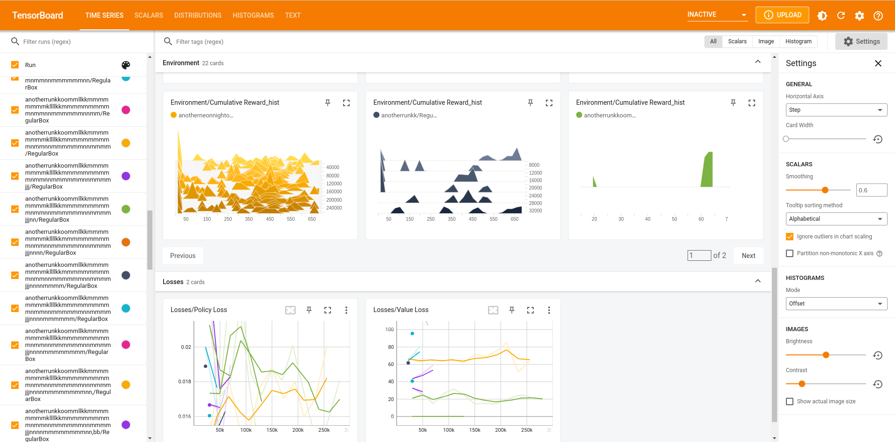

## Feature engineering:

[Adjust the size and orientation of boxes:]

1\. Boxes of dimension (3, 6, 3) are the same as boxes of dimension (3,
3, 6) rotated. If initial variability in size is reduced, problem is
more simplified for combination learning. Since boxes can come in in all
rotations, making them more uniform and ordered will help reduce
complexity

[Adjust the size of vertices array:]

1\. When constraining available vertices to only 3 "tripoints" for each
box placement, this will give us an array list of size 2n+1

-   Pros: better box placement, fewer boxes need to be repacked due to
    failing physics check, fewer max step to pack all boxes, fewer
    "holes" in placement

-   Cons: placement positions are constrained, some large spots remain
    unfilled due to lack of available vertex there, takes more time to
    train, smaller chance of getting it right

2\. When loosening vertices array to include all 7 vertices for the next
box's placement, our vertex array size becomes 6n+1 (currently giving
the best results)

-   Pros: more placement choices, least constraining, more complexity
    and flexibility

-   cons: a lot of boxes need to be repacked, increases the likelihood
    of bad box placement, high max step to finish packing due to
    increased need to repack, least stable model

3\. When constraining vertices selection down to one vertex with picking
the smallest subspace to pack a box, vertex position will not be one of
the features (still to be tested)

-   Pros: circumvents very bad box placement, no boxes will need to be
    repacked due to space check beforehand, least number of max step to
    finish packing, small spaces filled up first so less likely to have
    small empty spaces, most stable model

-   Cons: simple heuristics bottlenecks, computationally expensive, does
    not take full advantage of neural networks

[Normalize discrete vector array action space into continuous action
space:]

1\. selecting from Action space currently has 3 discrete branches:
select rotation from rotations, select box from boxes, and select vertex
from vertices. The vertex vector is a three-dimensional vector
representing coordinates in x,y,z space within the Unity engine.
Normalizing the vertex vector from a discrete variable, representing an
absolute position of say (8.25, 4.50, 16.75), to a continuous variable,
between 0.0 and 1.0 of say (0.345, 0.134, 0.488), may better enable the
agent to learn the relative space of the bin filled and the remaining
unfilled bin space.

Furthermore our end goal is to be able to find an approach that deals
with the variable size vertices array, and perhaps normalizing to
continuous variables may enable us to consider other models that are
better suited for yet require a continuous action space and state space.
For example, even our current implementation of PPO is suited for
continuous state and action space:

 
 
 

## Document performance, interpretation, and learning in markdown

This is the Tensorboard results of our training data from this week. We
have improved our Unity environment to allow for more realistic,
flexible, and trainable packing. First we added physics checks to ensure
"safe packing", which means no boxes will fall down due to their center
of gravity being off. We also use a vertices array list and an
additional check for overlap to guarantees that all of the boxes are in
contact without overlapping.

However, as the tensorboard results show, our model did not train well
given that it did not converge close to the maximum reward with low std.
In most of our training data, we had 3 discrete branches of action
space: a list of box sizes, a list of vertices, and a list of possible
rotations. If we have 40 boxes, we'll have 2n+1, or 81 number of
vertices where n is the number of boxes if we use our tripoints method,
and 6 rotations. This generates 40 \* 81 \* 6, or 19440 combination of
actions that can be chosen. The complexity will greatly increase if we
flex our vertices array to allow for 7n+1 number of vertices. This is
probably one of the reasons learning couldn't be done properly. Our
current key goal is therefore to reduce the number of possible
combinations of actions in the action space.

Another very important reason that the current RL model we use, which is
the PPO, failed to train is that part of our action space, which is a
variable array of vertices that constantly permutes from episode to
episode and being populated during an episode, does not lead to
trainable weights. Another ongoing goal is to research more in depth
recent discoveries such as Set Transformers that combat the problem of
having a high number of combinations/permutations. Our team has planned
next to discuss the paper: [Set Transformer: A Framework for
Attention-based Permutation-Invariant Neural
Networks](https://arxiv.org/abs/1810.00825)

 
 
 

## hyperparameter.yaml file (includes hyperparameters for curriculum learning):
behaviors:
  UnitBox:
    trainer_type: ppo
    hyperparameters:
      batch_size: 2048
      buffer_size: 20480
      learning_rate: 0.0003
      beta: 0.005
      epsilon: 0.2
      lambd: 0.95
      num_epoch: 3
      learning_rate_schedule: linear
    network_settings:
      normalize: true
      hidden_units: 512
      num_layers: 3
      vis_encode_type: simple
    reward_signals:
      extrinsic:
        gamma: 0.995
        strength: 1.0
    keep_checkpoints: 5
    max_steps: 30000000
    time_horizon: 1000
    summary_freq: 30000
  RegularBox:
    trainer_type: ppo
    hyperparameters:
      batch_size: 2048
      buffer_size: 20480
      learning_rate: 0.0003
      beta: 0.005
      epsilon: 0.2
      lambd: 0.95
      num_epoch: 3
      learning_rate_schedule: linear
    network_settings:
      normalize: true
      hidden_units: 512
      num_layers: 3
      vis_encode_type: simple
    reward_signals:
      extrinsic:
        gamma: 0.995
        strength: 1.0
    keep_checkpoints: 5
    max_steps: 30000000
    time_horizon: 1000
    summary_freq: 5555

  
environment_parameters:
  unit_box:
    curriculum:
      - name: MyFirstLesson # The '-' is important as this is a list
        completion_criteria:
          measure: reward
          behavior: UnitBox
          signal_smoothing: true
          min_lesson_length: 100
          threshold: 100.0
        value: 1.0
      - name: MySecondLesson # This is the start of the second lesson
        completion_criteria:
          measure: reward
          behavior: UnitBox
          signal_smoothing: true
          min_lesson_length: 100
          threshold: 0.6
          require_reset: true
        value: 2.0
      - name: MyLastLesson
        value: 3.0
  regular_box:
    curriculum:
      - name: MyFirstLesson # The '-' is important as this is a list
        completion_criteria:
          measure: reward
          behavior: RegularBox
          signal_smoothing: true
          min_lesson_length: 100
          threshold: 0.2
        value: 0.0
      - name: MySecondLesson # This is the start of the second lesson
        completion_criteria:
          measure: reward
          behavior: RegularBox
          signal_smoothing: true
          min_lesson_length: 100
          threshold: 0.6
          require_reset: true
        value:
          sampler_type: uniform
          sampler_parameters:
            min_value: 4.0
            max_value: 7.0
      - name: MyLastLesson
        value: 8.0