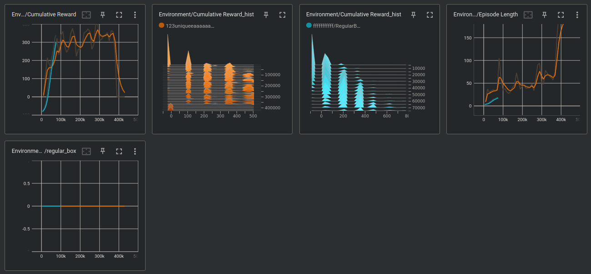

# Model Performance

*a "failed box placement" is an attempted box placement that fails one of our **three physics checks**, which prevent the agent from placing a box in an physically unrealistic position. In current training, we will punish (-reward) the agent and end the episode on a failed box placement.*
1. Gravity Check: is the box touching the ground or another box touching the ground?  
2. Protrusion Check: is the box not protruding through the side of the bin container?
3. Overlap Check: is the box not overlapping with any other placed box within the bin container? 
- for more on physics checks, see [**physics-check.md**](./physics-checks.md)

 

## -10f reward and end episode on failed box placement

Note the dropoff in cumulative reward at the end was due to a bug, where the agent stopped training, resulting in a cumulative reward of 0.
 
 

## -50f reward and end episode on failed box placement

 
 

## -10f (orange) vs -50f (blue) reward

 
When comparing metrics between the model tuned with two separate reward schedules, -10f (orange) and -50f (blue) for a failed box placement, we observe a ....

"increased penalty from -10f to -50f"
episode length is smaller due to a higher penalty, learning faster

