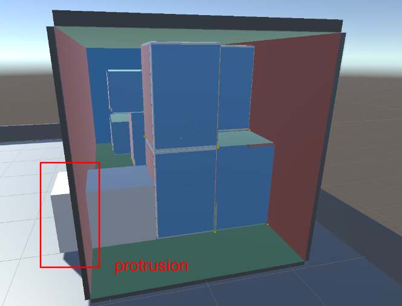

# Physics Checks

## 1. Gravity Check: is the box touching the ground or another box touching the ground?  

## 2. Protrusion Check: is the box not protruding through the side of the bin container?

## 3. Overlap Check: is the box not overlapping with any other placed box within the bin container? 